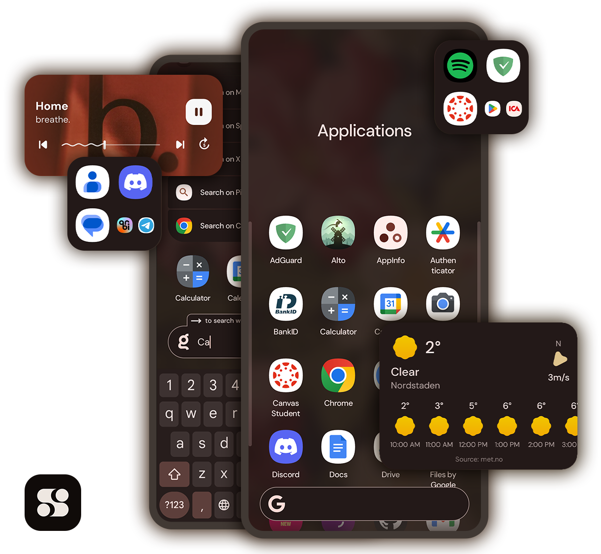

# Stario



[](https://github.com/albu-razvan/Stario/actions/workflows/build.yml)
[](https://discord.gg/WuVapMt9gY)
[](https://github.com/albu-razvan/Stario/releases/latest)
[](https://github.com/albu-razvan/Stario/commit)
[](https://shields.rbtlog.dev/com.stario.launcher)

## Overview

Inspired by the minimalist phone concept, Stario aims to keep functionality and productivity at
their peak in a simple and elegant format.

This repository contains the complete codebase for Stario, a full rewrite of the previous
Stario Launcher. This version offers significant improvements in both performance and usability.

> **Note:** This version supersedes the old Stario Launcher. The old Play Store version no longer
> supported and this repository represents the latest and actively maintained version.

## Features

- **Material You Support**  
  Integrates seamlessly with Android’s Material You dynamic theming system, adapting colors based on
  your wallpaper and device settings.

- **Application Customization**  
  Customize your home screen with various icon packs and shapes to personalize your experience.

- **Built-In Weather Widget**  
  Check current weather conditions and forecasts right from your home screen.

- **Global Search Integration**  
  Perform fast, privacy-respecting searches using Kagi directly from the launcher.

- **Minimalistic Media Player Controls**  
  Manage your media playback easily with integrated controls.

- **Application Categories**  
  Organize your app drawer with customizable categories for better app management.

- **RSS/Atom Reader**  
  Stay up-to-date with news and blog feeds via the integrated RSS/Atom reader.

- **Page Sorting**  
  Easily reorder your home screen pages to suit your workflow.

## Download

- Get the latest release of Stario from the [GitHub Releases page](https://github.com/albu-razvan/Stario/releases/latest).
- Find Stario at [IzzyOnDroid](https://apt.izzysoft.de/packages/com.stario.launcher).

## Compatibility

- Requires **Android SDK 29+** (Android 10.0 or later)
- Compatible with AOSP and most major OEM devices
- Should work with custom ROMs, though these are not officially tested — user feedback is welcome

## Development

You can quickly set up the development environment using the provided Dockerfile:

```bash
docker build --platform linux/amd64 -t stario-dev .

docker run --platform linux/amd64 --rm -it \
  -v </path/to/output>:/usr/local/stario/build \
  stario-dev
```

> Tip: Use `--rm` to automatically remove the container after use.

## Building

Should you wish to build the application yourself, run the build
script from within the development environment:

```bash
# Optionally, checkout to the tagged commit
git checkout v2.9

./build.sh
```

Alternatively, to also build a signed copy (APK and AAB), pass a keystore to the build script:

```bash
docker run --platform linux/amd64 --rm -it \
  -v </path/to/output>:/usr/local/stario/build \
  -v </path/to/keystore>:/usr/local/stario/keystore \
  stario-dev

# Optionally, checkout to the tagged commit
git checkout v2.9
  
./build.sh \
  -K /usr/local/stario/keystore/keystore.jks \
  -P keystore_password \
  -a key_alias \
  -p key_password
```

## Reproducible Builds

Check for RBs with the locally built unsigned APK and [apksigcopier](https://github.com/obfusk/apksigcopier). 

Firstly, copy the signature from the signed APK onto your built unsigned APK:

```bash
apksigcopier copy signed-from-source.apk unsigned-built-locally.apk out.apk
```

Then compare the two APKs:

```bash
apksigcopier compare stario-from-source.apk stario-built-locally.apk
```

> NOTE: `apksigcopier compare` requires [apksigner](https://developer.android.com/tools/apksigner).

## Join the Community

Got questions or want to connect with other users and contributors? Join
the [Stario Discord Server](https://discord.gg/WuVapMt9gY).
